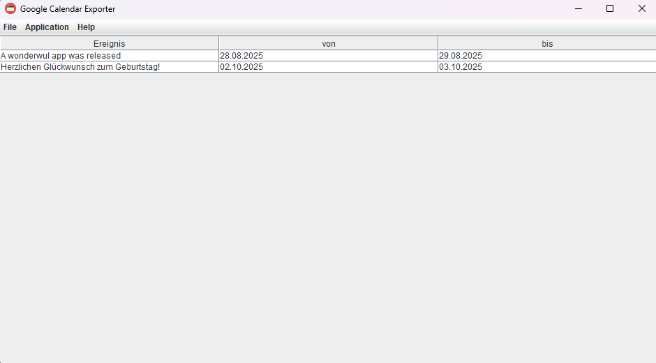
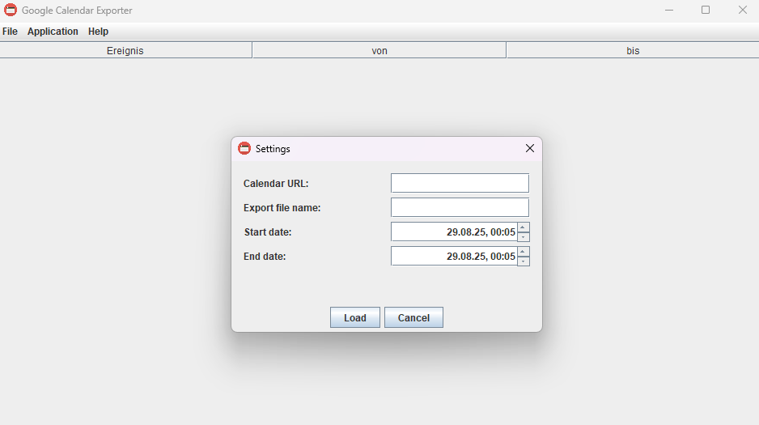

# Google Calendar Exporter

Simple Google Calendar Exporter GUI and CLI written in Java made for the Java lectures at DHBW.

## Key features

Users are able to:
- Export their calendar as iCalendar format
- Load different calendars using a Google calendar ID

## Open-source resources
- https://www.svgrepo.com/svg/49397/calendar